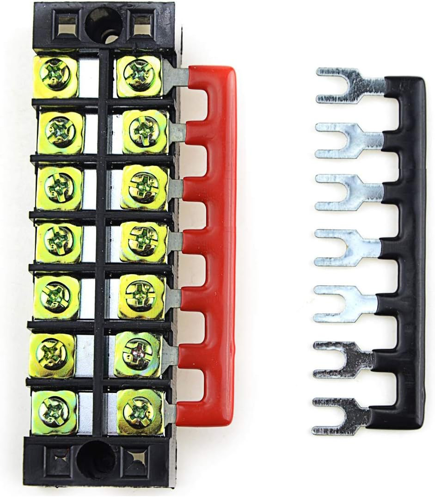
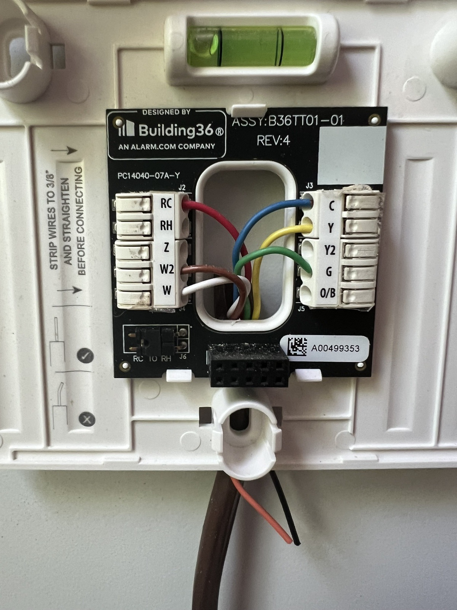
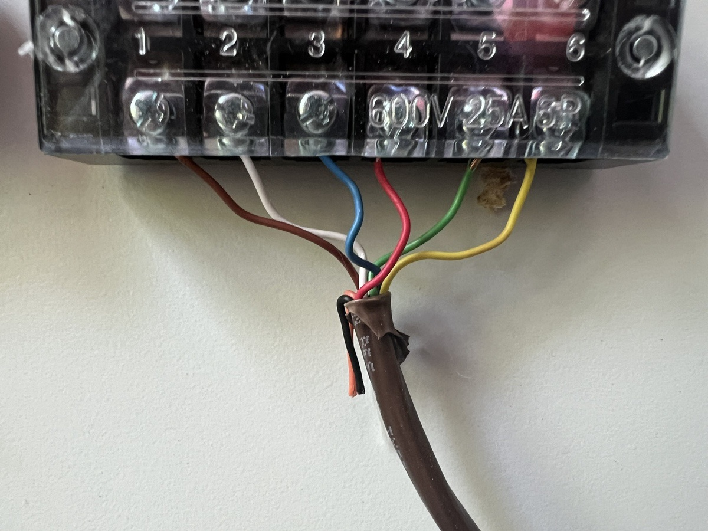
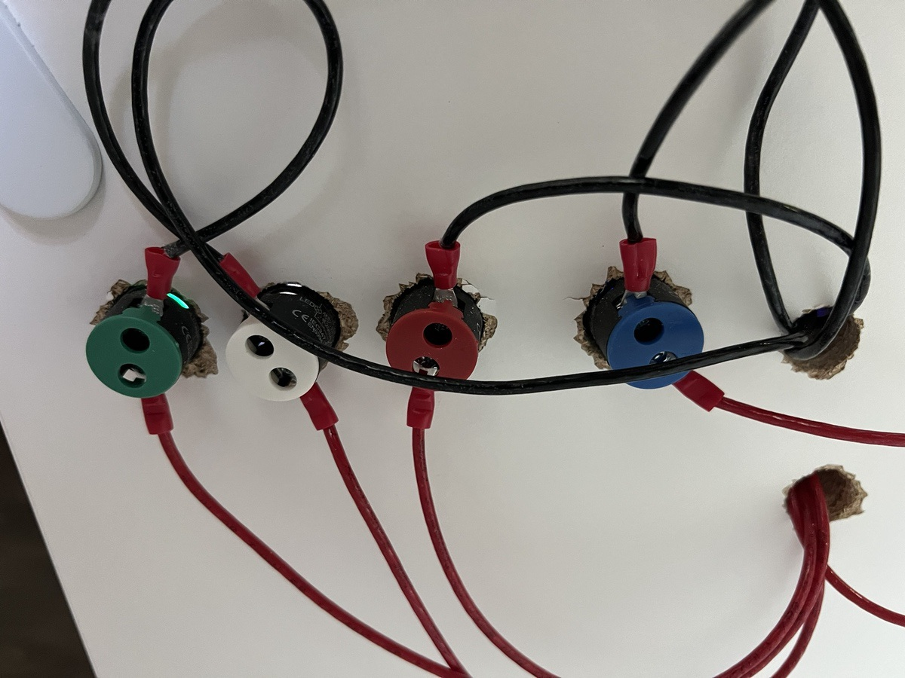
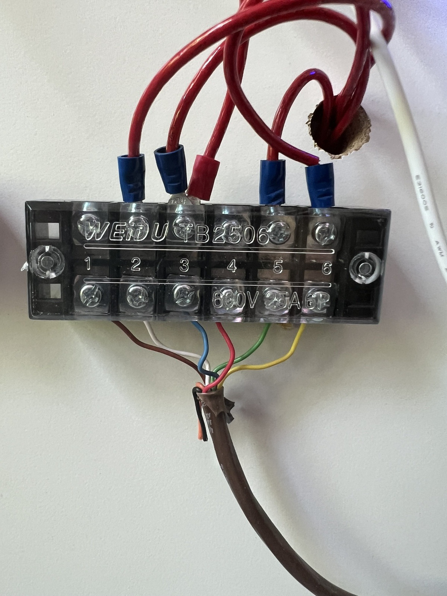

# Thermostat Test Rig

In this example, I will be simulating a standard split-system HVAC, with an additional Emergency Heating mode.

# Parts List:

- A thermostat.
- Thermostat Wire: 8-wire, 18-gauge wire(18/8) is what we're looking for. In the event you want to test a thermostat with Auxiliary or Emergency heating modes, you'll want to find 10-wire wiring, or run an additional 2 wires separately. When constantly connecting and disconnecting your test rig, you'll find that solid copper wire will break and just be a pain to work with. If you can, find a stranded variety. It's probably cheaper to get this from your local hardware store.
- Mounting board: you'll want something to put this on. I chose an old Ikea desk tabletop, but really anything that you can screw through will do. Plywood and MDF are also good options, and you can often find scrap in the cutting section of your local hardware or lumber supply store. You can also use this to house other smart-home tech for testing, too!
    
    
    
- Power drill: the thicker the board you choose, the more powerful the drill you'll need.
- A screwdriver: both the flat kind and the starry kind.
- Hole-saw or wood-boring kit: the particular size of hole saw that you need depends on the LED lights you select (see below), as well as the size of hole you'll need to run any wires behind the board (if you choose to do so). I erred on the side of caution, and picked up [this set](https://www.lowes.com/pd/Spyder-Stinger-14-Piece-Assorted-Woodboring-Spade-Drill-Bit-Set/1001148466) from Lowes.
- LED Lights: to simulate the HVAC's functions, you'll want display LEDs to show when the system is cooling, heating or the fan is on. The LED lights need to accept 24V AC. I chose [these LED lights](https://www.amazon.com/dp/B081FCFLVT?ref=ppx_yo2ov_dt_b_product_details&th=1), 22mm (7/8 in) hole diameter size, but any size will do. Just make sure you have a hole saw of the same size.
- 2 terminal blocks: You will need 2 terminal blocks: one for the load, and one for the neutral wire. Make sure each terminal block has at least 6 circuits, though 8 to 10 is optimal for testing multiple types of HVAC systems. I chose [this barrier-type set](https://www.amazon.com/Terminal-Block-10-Position-Set/dp/B09QHT8FPK/ref=sr_1_2?content-id=amzn1.sym.ea945d40-8e84-42be-ad5c-249b9bca6a40%3Aamzn1.sym.ea945d40-8e84-42be-ad5c-249b9bca6a40&crid=1IAFJWHUBD1OE&keywords=Terminal+Blocks&pd_rd_r=db98cc20-812c-4559-8c68-eedcf79c6248&pd_rd_w=8YR1Y&pd_rd_wg=wuayD&pf_rd_p=ea945d40-8e84-42be-ad5c-249b9bca6a40&pf_rd_r=FS043PDT23CT0HCZY4MY&pid=ljG8PU7&qid=1689814612&refinements=p_n_feature_thirteen_browse-bin%3A18945667011&s=industrial&sprefix=terminal%2Bstri%2Caps%2C117&sr=1-2), but there are many types of terminal blocks.
- 1 terminal barrier strip jumper: this will probably be included with your terminal block.

Terminal Barrier Block with Terminal Barrier Strip Jumpers

- LED Light Wire: we'll need wiring to connect the LEDs to the power, coming from the thermostat's terminal block (the Load side) and the neutral terminal block (the Return side). Choose the wire gauge that best works with your LED lights. It's important to get two colors of wire to distinguish the *Load* and *Return* (or neutral) sides of the circuit. Black and white wire (for *Load*/*Return*) is preferred, but red and black will also work. This may be cheaper at your local hardware store than online.
    
    
    
- A power supply: HVAC controls run on 24V AC. We're only powering LED lights, so a low-wattage transformer will be just fine, though any should work. Generally two types of these exist: bare transformers (usually labeled as door bell transformers) and plug-in power supplies. Door bell transformers are generally hard to wire up, so I would recommend a [plug-in type like this one](https://www.amazon.com/Transformer-Thermostat-Competible-Versions-Honeywell/dp/B07DJ7RHS5/ref=sr_1_6?keywords=24v+ac+transformer+plug+in&qid=1689816282&sprefix=24v+AC+transformer%2Caps%2C105&sr=8-6).
- Fork wire connectors: you will need at a handful of fork wire connectors in assorted sizes. I prefer crimp-style connectors, though heat-shrink connectors are just fine. Be sure you have connector sizes that match the sizes of the screws on both the terminal blocks and the LED lights.
    
    
    
- Stick-on Velcro
- Wire stripper/cutter
    
    
    
- Needle-nose or Electrician's Pliers
- Heat gun (or a bad-ass hair dryer): if you choose shrink-wrap Fork wire connectors)

# Prepare the board

Take your board, and mark the spaces where you want to drill. You're free to eyeball it (as I did), but I promise you'll appreciate yourself more later if you take the time now to get this right.

In my example, we'll have 5 lights:

- Green: The system is receiving power.
- White: The fan is running.
- Blue: The Cooling mode is active.
- Red: The Heating mode is active.
- Orange: The Emergency Heat mode is active.

Using the hole size of your LEDs, mark a space for each of the LED lights you'll install. Make sure you have enough room between each light for the bezel of the light to fit.

Example board layout

You can also add another hole to route the wires from the thermostat to the back of the board. In my case, I chose not to do this, and instead mounted my thermostat wires and connector block on the front of the board for easier access.

Now that you've measured and assured yourself this is the right thing to do, drill!

# Wiring up the thermostat

Using the instructions included with your thermostat, wire up the thermostat's connection block, using some thermostat wire (be sure to leave some extra wire hanging, just in case). Once the wires are connected, mount the thermostat connector block to the board. If you drilled a hole for your thermostat wires, run them through.

- Mount the thermostat connector block to the board, either using a screw (the thermostat probably included mounting hardware) or with handy-dandy Velcro.
- Typically, the wiring looks like this, but please check the thermostat's installation instructions:
- Y: Yellow Wire
- G: Green Wire
- C (Common): Blue Wire
- W: White Wire
- R: Red Wire
- E: Brown Wire

Common Thermostat wiring setup

# Wiring up the Terminal Blocks

We will have two terminal blocks: the Load block will carry current from the power supply to the thermostat; and the Return block, which will accept current from the LEDs, thereby completing the circuit.

If you chose to run your wires through the back of your board, you'll want to install your terminal blocks on the back.

- Securely fasten both terminal blocks to the board (or chance it with the Velcro, your call).
- Roughly measure the length of your thermostat wire, and ensure you'll have plenty to get to one of the terminal blocks. Cut it to length.
- Strip each wire in the cable using your cable stripper (or teeth), and apply a fork wire connector. Make sure the fork wire connector you choose is the right size for the terminal block.
- Once the fork wire connectors are attached, attach each one to a circuit on the terminal block.

# Install the Power Supply

Now we need to power this thing.

- Connect a fork wire connector to each of the power supply's leads:
- Attach one lead to the same circuit on the terminal block as the BLUE wire.
- Attach the other lead to any port on the Return terminal block.
- Install a black terminal jumper strip on the Return terminal block. This will ensure that all of the LEDs are wired into the circuit.

# Installing the LEDs

Now that you have the holes drilled, the thermostat wired up, the power supply installed and the terminal blocks installed, it's time for the big finish.

Each LED has two terminals; since this is AC, we don't care which one is which.

If you have black and white wire, it is preferred to use white here (white is the wire color for neutral, or Return). If you have red and black wire, use black here.

For each LED light:

- Using the LED Light Wire, cut a lengths that will run from the terminal block to the LED light.
- Place a fork connector the size for the terminal block on one end.
- Place a fork connector the size of the LED light's terminal on the other.
- Insert and secure the LED into the appropriate hole.
- Connect one terminal of the LED light, using the wire from above, to any open circuit on the Return terminal block.

# Wiring the LEDs to the Thermostat

So far, it's all been pretty easy; this is where the fun stuff starts.

The standard wiring setup for a thermostat looks like this:

We want to match our LEDs to specific functions; Green (System Power), White (Fan), Blue (Cooling), Red (Heating) and Orange (Emergency Heat).

If using black and white wire, use black here (black is the wire color for Load). If you have red and black wire, use red here instead.

For each LED light:

- Using the LED Light Wire, cut a lengths that will run from the terminal block to the LED light.
- Place a fork connector the size for the terminal block on one end.
- Place a fork connector the size of the LED light's terminal on the other.
- Insert and secure the LED into the appropriate hole.
    
    
    

Now, using the guide below, connect the appropriate LED wire fork connector to the appropriate circuit on the Load terminal block.

For me, it was:

- Yellow Wire: Blue LED (Cooling)
- Green Wire: White LED (Fan)
- Blue Wire: Green LED (System Power)
- White Wire: Red LED (Heating)
- Brown Wire: Orange LED (Emergency Heat)

If your thermostat doesn’t work, you may need to place a jumper between the Red and Blue wires.

# Test

Now that you have everything connected, you should be able to see your lights work in response to the thermostat's commands.

- Attach your thermostat to its mounting plate.
- Plug in the power supply.
- Adjust the thermostat's settings and watch the lights shine.